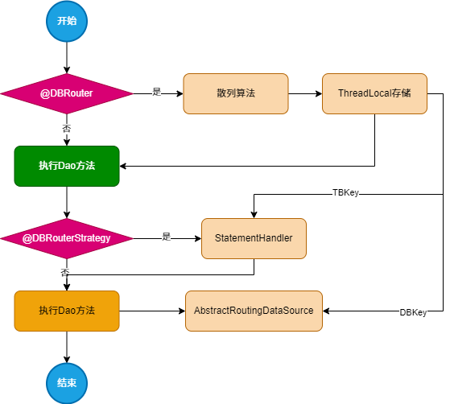

## 数据库路由组件

#### 如何使用？

本组件提供了近乎平常开发的体验，简单易上手。

1、在`application.yaml`中配置如下（支持数据连接池配置，`hikari`、`c3p0`、`druid`）

```yaml
# 路由配置
mini-db-router:
  jdbc:
    datasource:
      # 分库分表数，二者之和需为2的n次方（散列均匀）
      dbCount: 2
      tbCount: 4
      # db_0d 格式
      list: db01,db02
      # 默认数据库
      default: db00
      routerKey: userId
      db00:
        driver-class-name: com.mysql.cj.jdbc.Driver
        url: jdbc:mysql://127.0.0.1:3306/bugstack?useUnicode=true
        username: root
        password: 123456
        # 需要指明连接池类型
        pool-type: hikari
        pool:
          minimum-idle: 15 #最小空闲连接数量
          idle-timeout: 180000 #空闲连接存活最大时间，默认600000（10分钟）
          maximum-pool-size: 25 #连接池最大连接数，默认是10
          auto-commit: true  #此属性控制从池返回的连接的默认自动提交行为,默认值：true
          max-lifetime: 1800000 #此属性控制池中连接的最长生命周期，值0表示无限生命周期，默认1800000即30分钟
          connection-timeout: 30000 #数据库连接超时时间,默认30秒，即30000
          connection-test-query: SELECT 1
      db01:
        driver-class-name: com.mysql.cj.jdbc.Driver
        url: jdbc:mysql://127.0.0.1:3306/bugstack_01?useUnicode=true
        username: root
        password: 123456
        pool-type: hikari
        pool:
          minimum-idle: 15 #最小空闲连接数量
          idle-timeout: 180000 #空闲连接存活最大时间，默认600000（10分钟）
          maximum-pool-size: 25 #连接池最大连接数，默认是10
          auto-commit: true  #此属性控制从池返回的连接的默认自动提交行为,默认值：true
          max-lifetime: 1800000 #此属性控制池中连接的最长生命周期，值0表示无限生命周期，默认1800000即30分钟
          connection-timeout: 30000 #数据库连接超时时间,默认30秒，即30000
          connection-test-query: SELECT 1
      db02:
        # 支持不配做数据库
        driver-class-name: com.mysql.cj.jdbc.Driver
        url: jdbc:mysql://127.0.0.1:3306/bugstack_02?useUnicode=true
        username: root
        password: 123456
```

2、编写`xml`，针对分表的`xml`语句，仅需编写表名即可，无需添加"`_0d`"

用"`user_01`"表举例：

```xml
<select id="queryUserInfoByUserId" parameterType="cn.cat.spring.dbrouter.test.infrastructure.po.User"
            resultType="cn.cat.spring.dbrouter.test.infrastructure.po.User">
    SELECT id, userId, userNickName, userHead, userPassword, createTime
    FROM user
    where userId = #{userId}
</select>
```


#### 如何支持分库分表策略？

| 策略     | `@DBRouterStrategy` | `@DBRouter` |
| -------- | ------------------- | ----------- |
| 仅分库   | `false`             | `true`      |
| 仅分表   | `true`              | `false`     |
| 分库分表 | `true`              | `true`      |


#### 执行`SQL`语句流程



